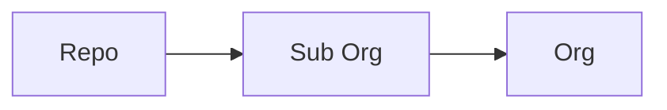

# Gi-Tops Admin - Organization and Repos

__Notice:__ _This repo contains configuration items that are meant as a reference and should not be run in production in your organization without additional testing_

## Project overview

The protections applied to repos in this organization via the
[gi-tops/safe-settings](https://github.com/gi-tops/safe-settings) repo which is a fork of
[github/safe-settings](https://github.com/github/safe-settings) includes some additional code
added to
[gi-tops/safe-settings/lib/plugins/branches.js](https://github.com/gi-tops/safe-settings/blob/main-enterprise/lib/plugins/branches.js).
The changes will create a default branch by committing a README.md to the repo if the default
branch doesn't exist. It will apply the protections to the
default branch and create an issue that tags the user `y-me-y` with details of the changes to the repository.

`Safe-settings` actions are triggered via an organization
webhook and connected via an installed Github App - [Gi-Tops Safe Settings
Enforcer](https://github.com/apps/gi-tops-safe-settings-enforcer) and is running as an app
deployed using Heroku.

## Requirements

- __Node.js Environment:__  _Docker_, _local_, _remote endpoint_ used for development and to run
  [gi-tops/safe-settings/index.js](https://github.com/gi-tops/safe-settings/blob/main-enterprise/index.js)
  as a web app.
- __Github Organization:__ A GitHub Organization is required to test and deploy the `safe-settings`
  bot.
  __Github App:__ The Github App will be installed in the aforementioned Github Organization and
  provides repository and organization permissions to the `safe-settings` bot and a webhook
  that subscribes to specific organization-level events.

  - Branch protection rule
  - Check run
  - Check suite
  - Push
  - Pull request
  - Repository

- __Hosting for Bot:__  Current demo bot has been deployed via Heroku but other environments are
  documented via the [gi-tops/safe-settings](https://github.com/gi-tops/safe-settings) repo -
  deployment guides located here
  [gi-tops/safe-settings/docs/deploy.md](https://github.com/gi-tops/safe-settings/blob/main-enterprise/docs/deploy.md)

_Note:_ You will need three pieces of information from the Github App

1. App Id
1. Private Key Pem File
1. Webhook Secret

## How `safe-settings` works

### What settings are we applying

Let's look at some specific policies and the protections they provide.

_Note:_ All protection rules discussed apply to branches that match the pattern specified in the
`Branch name pattern` field.

- __Require a Pull request before merging:__ This policy prevents any user from directly committing to the protected branch. There is also a subset of protections that can be enabled after enabling this protection.
  - __Require approvals:__ After enabling this rule, you will be able to specify the required number of approvals to merge an open Pull request to the protected branch.
  - __Dismiss stale pull request approvals when new commits are pushed:__ This protection is valuable
    when one approver requests a change and the original committer adds new
    commits to the merging branch. The applied protection will automatically dismiss all prior approvals preventing
    unreviewed code changes from being merged to a protected branch without another review.
  _ __Require review from Code Owners:__ When a `CODEOWNERS` file is present in the repo, and a file
    marked as being owned is modified, the individual or team that owns the file will
    be automatically required to review the code for approval.
- __Include Administrators:__ This ensures that all restrictions are also applied to administrators
  to prevent any individual users from bypassing the protections specified.

### Centralized policy as code

The configuration files in this repo provide a reference for applying specific protections to your
repositories' default branch allows organizations to indicate policy as code.

In `safe-settings,` all the settings are stored centrally in an `admin` repo within the organization. We centralize all configurations for the organization in one repo vs. applying configuration to repos individually.

Configuration files must have a `.yml` extension only, `.yaml` extensions are ignored, and must exist in the `.github` directory of the admin repo.

### Hierarchy

There are three levels at which we could manage the settings:

- __`Org-level:`__ Settings are defined in `.github/settings.yml.`
- __`Suborg:`__ A `suborg` is an arbitrary collection of repos that are typically grouped together
    via projects, business units, or teams. The `suborg` settings reside in a yaml file for each
    `suborg` in the `.github/suborgs` directory.
- __` repo:`__ Settings reside in a Repo specific yaml in the `.github/repos` directory.

The recommendation is to split the out configuration into Repo, Suborg, and Org-level settings. Using a
CODEOWNERS file will allow you to authorize individual people, teams, and business units to control
specific settings for their repos. To ensure teams maintain a baseline security configuration, you
can add additional validations at the org level to override any controls that don't meet the
minimum protections for the organization.

_Note:_  The precedence order is `.github/repos/*.yml > .github/suborgs/*.yml > .github/settings.yml`



### Examples

Below we will provide some examples how to configure a baseline set of protections for the
organization using the `settings.yml` inside the `.github` of the `admin` repo.

#### Organization settings

In the example below, we will create a file that defines our default branch, and requires a pull request to the main branch with two approvals, including a review from the code owners. We also dismiss all reviews that approved the code changes before the most recent commit and will be enforced for administrators.

- `./github/settings.yml`

```yml
repository:
  default_branch: main
branches:
  - name: default
    protection:
      required_pull_request_reviews:
        required_approving_review_count: 2
        dismiss_stale_reviews: true
        require_code_owner_reviews: true
      enforce_admins: true
# Excluded repos for testing purposes.
# These repos aren't controled via the safe-settings bot.
restrictedRepos:
  exclude: ['admin', '.github', 'safe-settings']
```

#### Sub org settings

This section will be filled in later to talk about how we can configure a specific set of repos
for individual teams inside an organization.

#### Repo settings

This section will be filled in later to talk about how we can configure a specific set of independent repos.

## Ussage

### Prerequisites

- Github App
- Heroku CLI

### Create Github app

#### Register new Github App

Create a new GitHub App with:

- __Homepage URL:__ the URL to the GitHub repository for your app
- __Webhook URL:__ Use [https://example.com/](https://example.com/) for now, until we launch our heroku app
- __Webhook Secret:__ Generate a unique secret with `openssl rand -base64 32` and save it because you'll need it in a minute to configure your deployed app.

#### Permissions & events

1. Set the correct __Permissions & events__ for the GitHub Integration:

##### Permissions

###### Repository Permissions

- Administration: **Read & Write**
- Checks: **Read & Write**
- Commit statuses: **Read & Write**
- Contents: **Read & Write**
- Issues: **Read & Write**
- Pull requests: **Read & Write**

###### Organization Permissions

- Members: __Read & Write__
- Administration: __Read & Write__

##### Events

- Branch protection rule
- Check run
- Check suite
- Push
- Pull request
- Repository

1. Download the private key from the app.

1. Make sure that you click the green __Install__ button on the top left of the app page. This gives you an option of installing the app on all or a subset of your repositories. __Important: Install this App for `All` repos in the Org__

### Heroku Deployment

After [creating the GitHub App](#create-github-app)

1. Make sure you have the [Heroku CLI](https://devcenter.heroku.com/articles/heroku-cli) client installed.

1. Clone the app that you want to deploy. e.g. `git clone https://github.com/gi-topbs/safe-settings`

1. Create the Heroku app with the `heroku create` command:

   ```bash
   heroku create
   Creating rocky-plains-38240... done, stack is cedar
   http://rocky-plains-38240.herokuapp.com/ | git@heroku.com:rocky-plains-38240.git
   Git remote heroku added
   ```

1. Go back to your app settings page ( [Gi-Tops Safe Settings
Enforcer](https://github.com/apps/gi-tops-safe-settings-enforcer) ) and update the __Webhook URL__ to the URL of your deployment, e.g. `http://rocky-plains-38240.herokuapp.com/`.

1. Configure the Heroku app, replacing the `APP_ID` and `WEBHOOK_SECRET` with the values for those variables, and setting the path for the `PRIVATE_KEY`:

   ```bash
   heroku config:set APP_ID=aaa \
     WEBHOOK_SECRET=bbb \
     PRIVATE_KEY="$(cat ~/Downloads/*.private-key.pem)"
   ```

1. Deploy the app to heroku with `git push`:

   ```bash
   git push heroku master
   ...
   -----> Node.js app detected
   ...
   -----> Launching... done
   http://rocky-plains-38240.herokuapp.com deployed to Heroku
   ```

1. Your app should be up and running! To verify that your app
    is receiving webhook data, you can tail your app's logs:

   ```bash
    heroku config:set LOG_LEVEL=trace
    heroku logs --tail
    ```

### Testing

After the previous steps have been applied try creating new repos, modifying existing branch
protections rules and see if it's working as expected.

## References

- Uses [github/safe-settings](https://github.com/github/safe-settings) to provide most
  functionality. The main reason for this was code reuse rather than recreating the wheel.

## TODO

- Add test for the additional functionality added in.
- Detail the flow of the requests.
- Break away from using as much direct language from the safe-settings repo.
- Talk about validating configs ensuring they meet the security baseline.
- Add examples for repos and suborgs.
