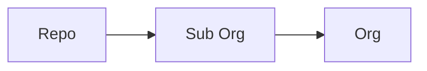

# Gi-Tops Admin - Oranization and Repos

__Notice:__ _This repo cotains configuration items that are meant as a reference and should not be
applied in your organization without additional testing_

## Project Overview

The protections applied to repos in this organization are controlled via the
[gi-tops/safe-settings](https://github.com/gi-tops/safe-settings) repo which is a fork of
[github/safe-settings](https://github.com/github/safe-settings) and includes some additional code
added to
[gi-tops/safe-settings/lib/plugins/branches.js](https://github.com/gi-tops/safe-settings/blob/main-enterprise/lib/plugins/branches.js)
that will create a default branch based on what is in the configuration files by adding a README.md
to the repo. If the README.md and default branch already exists it will apply the protections to the
default branch and create an issue that tags the user `y-me-y` with the details of what specific
changes were made to the repository.

`Safe-settings` actions are triggered via and organization
webhook and connected via an installed Github App - [Gi-Tops Safe Settings
Enforcer](https://github.com/apps/gi-tops-safe-settings-enforcer) and is running as an app
deployed using Heroku.

## Requirements

- __Node.js Environment:__  _Docker_, _local_, _remote endpoint_ used for development and to run
  [gi-tops/safe-settings/index.js](https://github.com/gi-tops/safe-settings/blob/main-enterprise/index.js)
  as a web app.
- __Github Oranization:__ A GitHub Oranization is required to test and deploy the `safe-settings`
  bot.
  __Github App:__ The Github App will be installed in the aforementioned Github Oranization and
  will provide repository and organization permissions to the `safe-settings` bot as well a webhook
  that subscribes to specific organization level events.

  - Branch protection rule
  - Check run
  - Check suite
  - Push
  - Pull request
  - Repository

- __Hosting for Bot:__  Current demo bot has been deployed via Heroku but other environments are
  documented via the [gi-tops/safe-settings](https://github.com/gi-tops/safe-settings) repo -
  deployment guides located here
  [gi-tops/safe-settings/docs/deploy.md](https://github.com/gi-tops/safe-settings/blob/main-enterprise/docs/deploy.md)

_Note:_ You will need three pieces of information from the Github App

1. App Id
1. Private Key Pem File
1. Webhook Secret

## How `safe-settings` works

### Centralized Configuration

In `safe-settings` all the settings are stored centrally in an `admin` repo within the
organization. The idea being we centralize all configuration for the organization in one repo vs
applying configuration to repos individually.

Configuration files must have a `.yml` extension only. `.yaml` extension is ignored, for now and
must exist in the `.github` directory of the admin repo.

### Hierarchy

There are 3 levels at which the settings could be managed:

- __`Org-level:`__ Settings are defined in `.github/settings.yml`
- __`Suborg:`__ A `suborg` is an arbitrary collection of repos that are typically grouped together
    via projects, business units, or teams. The `suborg` settings reside in a yaml file for each
    `suborg` in the `.github/suborgs` directory.
- __`Repo:`__ Settings reside in a repo specific yaml in the `.github/repos` directory.

The recommendations is to split the out configuration into Repo, Suborg and Org-level settings. Using a
CODEOWNERS file will allow you to authorize individual people, teams and business units to control
specific settings for their repos. To ensure teams maintain a baseline security configuration you
can add additional validations at the org level to override any controls that don't meet the
minimum protections for the organization. _Additional information here_ - [Config Validation](#config-validation)

_Note:_  The precedence order is repo > suborg > org (.github/repos/*.yml > .github/suborgs/*.yml > .github/settings.yml)

### Examples

WIP
